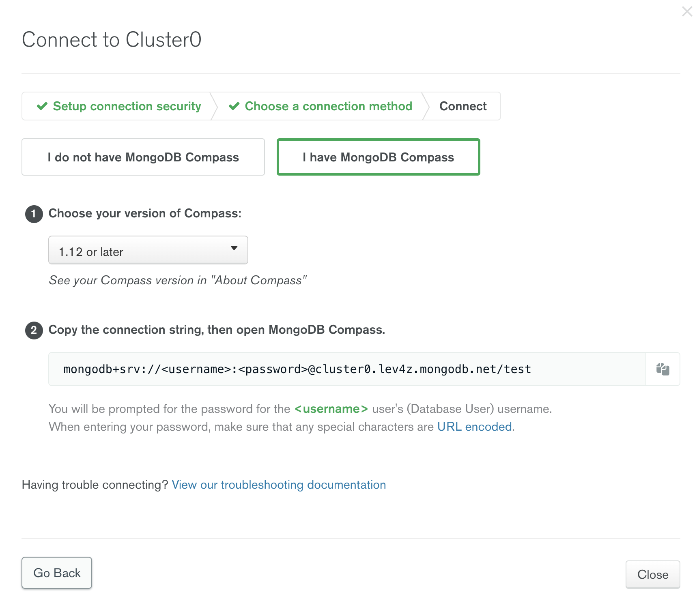
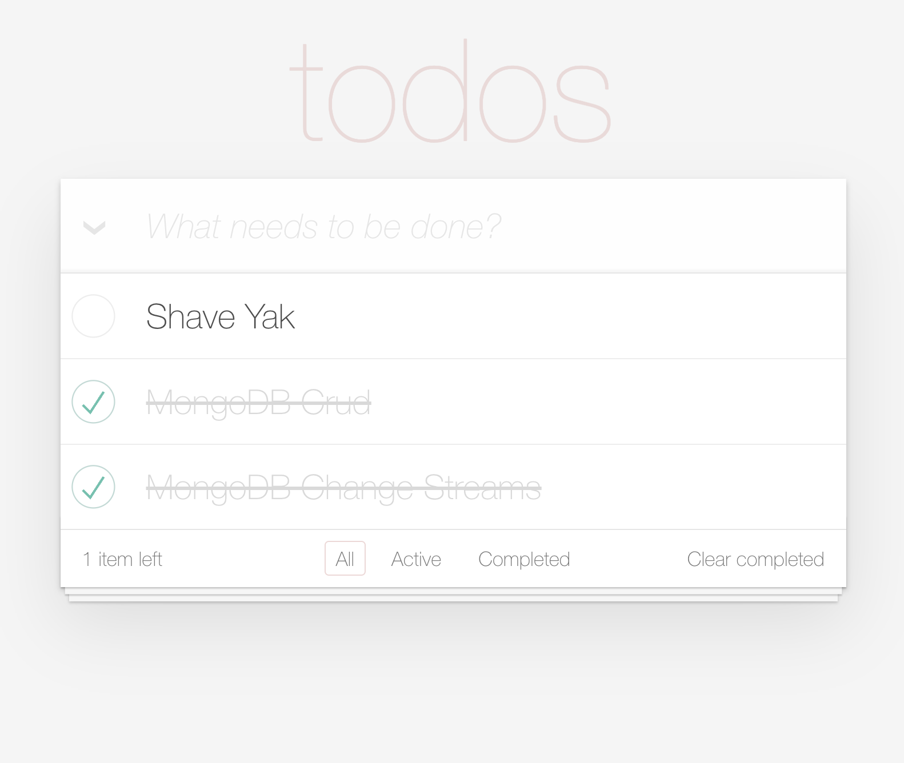
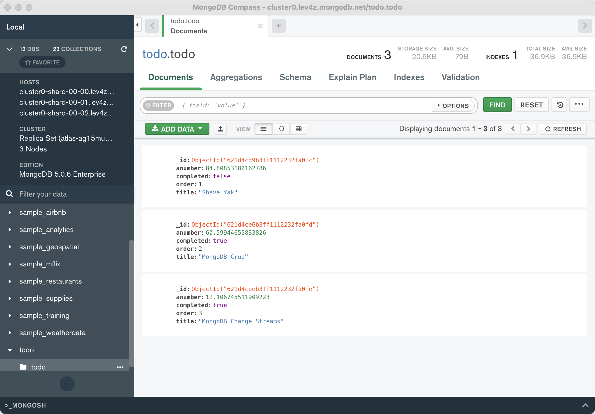

# Steps

1. Create an account, cluster, user and network access at 

https://www.mongodb.com/basics/mongodb-atlas-tutorial

2. Update application.properties, the mongodb.com console has the string you need 

3. mvn quarkus:dev

4. In your browser, `http://localhost:8081/todo.html`

5. Now go create/update todo documents

6. Build for Sandbox
mvn package -Dquarkus.package.type=uber-jar

7. Drag & Drop

